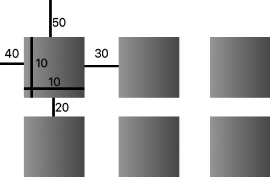

# spritesheet-cut
 
Split a spritesheet into individual sprites

### Table of contents

- [Installation](#installation)
- [Usage](#usage)
- [Args List](#args-list)

# Installation


Clone the github repo
```
$ git clone https://github.com/georgehawkins0/spritesheet-cut.git
```
Change Directory

```
$ cd spritesheet-cut
```
Install requirements
```
$ python3 -m pip install -r requirements.txt
```

# Usage

Example usage on the following sheet:
<p align="center">

</p>


```
python3 cut.py -f Tilesheet.png -w 10 -hi 10 -x 40 -y 50 -nx 3 -ny 2 -gx 30 -gy 20
```


# Args List
```
usage: cut.py [-h] [-f FILENAME] [-w WIDTH] [-hi HEIGHT] [-x XOFFSET] [-y YOFFSET] [-nx NUMX] [-ny NUMY]
              [-gx GAPX] [-gy GAPY]

Crop a tileset into individual tiles

options:
  -h, --help            show this help message and exit
  -f FILENAME, --filename FILENAME
                        The filename of the tileset to crop
  -w WIDTH, --width WIDTH
                        The width of the tiles
  -hi HEIGHT, --height HEIGHT
                        The height of the tiles
  -x XOFFSET, --xoffset XOFFSET
                        The x offset of the first tile
  -y YOFFSET, --yoffset YOFFSET
                        The y offset of the first tile
  -nx NUMX, --numx NUMX
                        The number of tiles in the x direction
  -ny NUMY, --numy NUMY
                        The number of tiles in the y direction
  -gx GAPX, --gapx GAPX
                        The gap between each tile in the x direction
  -gy GAPY, --gapy GAPY
                        The gap between each tile in the y direction